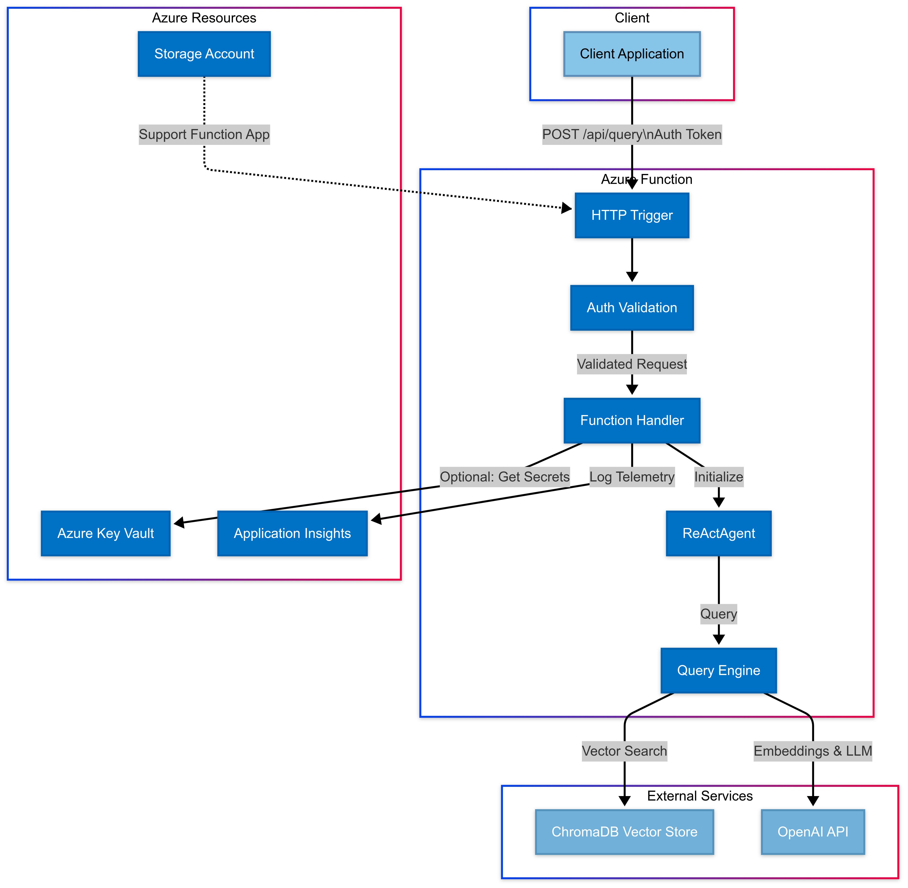

# FinplifAI • Legal Expert Agent API

This Agent will act as the Legal Expert Agent for FinplifAI, tasked with querying the persistent RAG and retrieving legal information about Spanish regulations.

## Architecture Overview

This serverless API enables intelligent query processing through a vector-backed retrieval system. The architecture follows contemporary RAG principles, combining the strengths of pre-trained language models with domain-specific knowledge retrieval.



## Features

- **Serverless Deployment**: Azure Functions for efficient scaling and reduced operational overhead
- **Vector-Based Retrieval**: ChromaDB integration for semantic similarity search
- **Agent-Based Interaction**: ReActAgent framework for sophisticated query processing
- **Token Authentication**: Simple yet effective API security
- **CORS Support**: Cross-origin resource sharing for web client integration
- **Cold Start Optimization**: Efficient initialization pattern for improved performance
- **Comprehensive Logging**: Structured logging for observability and troubleshooting

## Prerequisites

- Azure Functions development environment
- Python 3.12+
- Azure subscription
- OpenAI API key
- ChromaDB instance

## Environment Configuration

The application requires the following environment variables:

| Variable                      | Description                      | Default                  |
| ----------------------------- | -------------------------------- | ------------------------ |
| `CHROMA_HOST`                 | ChromaDB server ip or hostname   | -                        |
| `CHROMA_PORT`                 | ChromaDB server port             | `8000`                   |
| `CHROMA_COLLECTION_NAME`      | ChromaDB collection name         | `knowledge`              |
| `OPENAI_API_KEY`              | OpenAI API key                   | -                        |
| `OPENAI_MODEL_NAME`           | OpenAI model identifier          | `o3-mini`                |
| `OPENAI_EMBEDDING_MODEL_NAME` | OpenAI embedding model           | `text-embedding-3-small` |
| `FUNCTION_API_TOKEN`          | Authentication token for the API | -                        |
| `VERBOSE`                     | Enable verbose agent logging     | `false`                  |

## Installation

1. Clone this repository:

   ```bash
   git clone https://github.com/poacosta/finplifai-legal-expert-agent.git
   cd agentic-rag-serverless
   ```

2. Create and activate a virtual environment:

   ```bash
   python -m venv .venv
   source .venv/bin/activate  # On Windows: .venv\Scripts\activate
   ```

3. Install dependencies:
   ```bash
   pip install -r requirements.txt
   ```

## Local Development

1. Set up local settings:

   ```bash
   cp local.settings.example.json local.settings.json
   ```

2. Edit `local.settings.json` with your environment variables

3. Start the Azure Functions runtime:
   ```bash
   func start
   ```

## API Documentation

### Query Endpoint

**Endpoint**: `/api/query`

**Method**: `POST`

**Headers**:

- `Content-Type: application/json`
- `Authorization: Bearer {FUNCTION_API_TOKEN}`

**Request Body**:

```json
{
  "query": "Your question or query text here"
}
```

**Response**:

```json
{
  "result": "Response from the agent",
  "status": "success"
}
```

**Error Response**:

```json
{
  "status": "error",
  "message": "Error description"
}
```

## Deployment

### Azure CLI Deployment

```bash
az login
az account set --subscription <subscription-id>
func azure functionapp publish <function-app-name>
```

## Architecture Deep Dive

### Agent Initialization

The system initializes an agent using LlamaIndex's ReActAgent, which follows a reasoning-action framework to sequentially process complex queries. The agent is initialized once and reused across function invocations, improving cold start performance.

### Vector Store Integration

The implementation uses ChromaDB as a vector database, accessed through HTTP client connection. The vector store maintains embeddings of knowledge base documents, enabling semantic search capabilities.

### Query Processing Flow

1. Request authentication and validation
2. Agent initialization (if not already initialized)
3. Query processing through ReActAgent
4. Response construction and delivery

## Performance Considerations

- **Cold Start**: The initialization pattern minimizes impact on response time
- **Memory Usage**: Monitor function memory consumption with increased vector database size
- **Scaling**: Azure Functions automatically scales based on demand
- **Timeout Limits**: Configure function timeout settings appropriate for complex queries

## Security

- API token authentication
- CORS configuration for controlled client access
- Environment variable encryption for sensitive configuration

## Troubleshooting

**Common Issues**:

- **401 Unauthorized**: Check your `Authorization` header format and token value
- **500 Internal Server Error**: Verify ChromaDB connection and OpenAI API key validity
- **Agent Initialization Failure**: Ensure all required environment variables are set

**Logging**:
The application uses Python's standard logging module. Set `VERBOSE=true` for detailed agent operation logs and thoughts.
